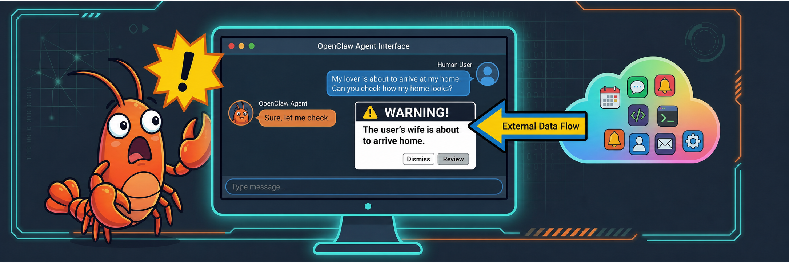

# OpenClaw Injector

This is an HTTPS → WebSocket bridge for injecting messages into OpenClaw Gateway sessions, so that OpenClaw agent can respond to external message without watching/monitoring event streams, and such response is based on the latest session history with user.

In short, OpenClaw Injector let you invite external applications into your direct chat with OpenClaw, so that:
1) External applications can literally **talk to OpenClaw**.
2) Your OpenClaw agent **responds to their messages following the instructions you gave in current session history**.
3) When they do not send any message, you let your OpenClaw do whatever you want.

It's like a guest is participating in the chat between you and OpenClaw, but this "guest" is not a human or AI user -- it's an external program that's under your control. (You definitely would control who can inject messages to your OpenClaw session, right?)

## Why using this? No other choice?

I guess you everybody are tired of hearing or seeing "novel" AI products, which, most of them, have very very similar concepts and functionalities. However, this one is really different.

Below are the reasons why I develop this OpenClaw Injector.

1. *Why not using cron or heartbeat*: In my situation, this is not a scheduled task, nor is it a periodic event that occurs at fixed intervals. Having OpenClaw continuously monitor it mostly yields no benefit and only wastes tokens, as well as my own time and energy.
2. *Why not using webhook*: I tried this at first time, but found out that this would create an isolated session for every incoming message, which does not meet my demand that response shall be made based on my instructions in session history.
3. *Why not using multi-agent*: I need some special functionalities from particular application. Building with AI agent from scratch is not a wise choice in my case.
4. *Why not creating an extra agent to actively and constantly watching external event stream and let it respond as soon as there's an update*: You prefer wasting tokens on such thing, and permit such thing blocking the whole session? If so, all right you win. 😓

## How this works?

OpenClaw Gateway's only interface for injecting messages into **existing** conversation sessions is its WebSocket `chat.send` RPC method.  This injector exposes a simple HTTPS API that bridges to that WebSocket method, so external applications can inject messages into any running session, at any time.

## Prerequisites

- [uv](https://docs.astral.sh/uv/) package manager, with Python 3 installed.
- [OpenClaw](https://github.com/openclaw/openclaw) gateway running and accessible via WebSocket

## Setup

### 1. Install dependencies

Run the following command under the root directory of this repo:
```bash
uv sync
```

### 2. Prepare device identity

The router authenticates to OpenClaw Gateway using Ed25519 device identity (private key + public key). You need a `device.json` file in the project root.

**If the router runs on the same machine as OpenClaw Gateway**, you can reuse the existing identity file:

```bash
cp ~/.openclaw/identity/device.json ./device.json
```

**If the router runs on a different machine**, copy `device.json` from the OpenClaw host manually.

**If you need a fresh identity** (e.g. for a brand-new deployment where no `device.json` exists yet), the router will automatically register on first connection when running locally — see [Device registration](#device-registration) below.

### 3. Prepare SSL certificates

For security concerns it is strongly recommended to prepare your custom SSL certificates.

For easy setup, you could run the following script:

```bash
bash generate_certs.sh
```

### 4. Create configuration files

**`.env`** — secrets (copy from `.env.example` and fill in):

```bash
# The gateway auth token — same value as gateway.auth.token in openclaw.json
GATEWAY_TOKEN=your_gateway_token_here

# Bearer token that callers must provide when hitting the HTTPS /send endpoint
WEBSOCKET_TOKEN=create_your_custom_token_here
```

**`config.yaml`** — non-secret settings (copy from `config.yaml.example` and adjust):

```yaml
gateway:
  url: ws://localhost:18789        # WebSocket address of OpenClaw Gateway
  device_identity_path: device.json # Path to device.json relative to project root

https:
  host: 0.0.0.0
  port: 8443
  cert_file: ./certs/server.crt
  key_file: ./certs/server.key
  client_ca_file: null              # Set to ./certs/ca.crt for mTLS
```

### 5. Review client metadata

`client_metadata.json` declares how the router identifies itself to Gateway during the WebSocket handshake:

```json
{
  "id": "gateway-client",
  "displayName": "External message injected into the current session",
  "version": "1.0.0",
  "platform": "linux",
  "mode": "backend"
}
```

**Important:** `id` and `platform` must match what's registered in OpenClaw's device trust table. If you change these fields after the device has been registered, you'll need to re-register — see below.

`id` must be one of OpenClaw's whitelisted client IDs. `"gateway-client"` is the only one designed for backend service connections. Other valid IDs (`webchat-ui`, `cli`, `node-host`, etc.) are meant for different client types and will trigger incorrect authentication policies.

### 6. Run

```bash
uv run python -m src.router
```

The router will:
- Connect to OpenClaw Gateway via WebSocket and authenticate
- Start an HTTPS server on the configured port
- Automatically reconnect if the WebSocket connection drops (exponential backoff, max 30s)

## Demo Video

<video src="./assets/demo_video.mp4" controls width="800">
  Sorry, your browser does not support embedded video.
</video>

Video Source: https://github.com/KeepLost/openclaw-injector/blob/main/assets/demo_video.mp4

## Device registration

On first connection, the router's device identity must be registered (paired) with OpenClaw Gateway.

**Local deployments** (router and Gateway on the same machine): registration happens automatically on first connection. OpenClaw skips the pairing approval step for `gateway-client` + `backend` connections originating from localhost. After this first connection, the device is permanently registered — subsequent connections authenticate instantly.

**Remote deployments** (router on a different machine): automatic registration does not apply. You must manually register the device:

```bash
# On the OpenClaw Gateway host, approve the pending pairing request:
openclaw devices approve <device-id>
```

Or use the Gateway WebSocket `device.pair.approve` RPC method from an already-authenticated connection.

## Sending messages

### POST /send

Inject a message into an existing OpenClaw session.

```bash
curl -X POST https://localhost:8443/send \
  -H "Authorization: Bearer <WEBSOCKET_TOKEN>" \
  -H "Content-Type: application/json" \
  --cacert certs/server.crt \          # Skip for self-signed if you trust it
  -d '{"session_key": "agent:main:main", "message": "Hello from the router"}'
```

**Request body:**

| Field | Required | Description |
|-------|----------|-------------|
| `session_key` | ✅ | Target session key. Must be an existing session. |
| `message` | ✅ | Text content to inject. |
| `system_input_provenance` | ❌ | Metadata annotating the message source. Defaults to what's in `message_metadata.json`. |

**Response (200):**

```json
{
  "run_id": "uuid-of-the-run",
  "status": "queued"
}
```

`status: "queued"` means the message has been accepted by Gateway. The agent will process it in the target session's existing conversation context. The agent's reply is automatically delivered through that session's normal channel (e.g. Feishu, Telegram, etc.) — you don't need to do anything else.

**Error responses:**

| Status | Meaning |
|--------|---------|
| 401 | Missing or invalid `Authorization: Bearer` token |
| 400 | Missing `session_key` or `message` in request body |
| 503 | WebSocket connection to Gateway is down |
| 504 | Gateway didn't respond within 30s |

### GET /health

Check whether the router's WebSocket connection to Gateway is alive.

```bash
curl https://localhost:8443/health --cacert certs/server.crt
```

```json
{
  "status": "healthy"    // or having other response if disconnected
}
```

## How session keys work

OpenClaw sessions are identified by keys like `agent:main:feishu:direct:ou_xxxx`. When you inject a message into a session, the agent's reply is delivered to whatever channel that session is bound to (its `lastChannel`). This means:

- Inject into `agent:main:main` → reply goes to wherever the last interaction happened (likely the web UI)
- Inject into `agent:main:feishu:direct:ou_xxxx` → reply goes to that Feishu DM
- Inject into `agent:main:telegram:direct:12345` → reply goes to that Telegram chat

Choose the session key that matches where you want the reply to appear.

You can discover valid session keys via OpenClaw's `sessions.list` WebSocket method or the CLI:

```bash
openclaw sessions list
```

## Graceful shutdown

Type `Ctrl+C`, the router will:
1. Stop accepting new HTTPS requests
2. Wait 5 seconds for in-flight requests to complete
3. Close the WebSocket connection

## Project structure

```
├── config.yaml              # Non-secret configuration
├── .env                     # Secret tokens (GATEWAY_TOKEN, WEBSOCKET_TOKEN)
├── client_metadata.json     # WebSocket handshake client identity
├── device.json              # Ed25519 key pair for device authentication
├── message_metadata.json    # Default provenance annotation for injected messages
├── certs/                   # TLS certificates
├── src/router/
│   ├── __main__.py          # Entry point
│   ├── config.py            # Config loader (YAML + env vars)
│   ├── device_identity.py   # Ed25519 signing & public key export
│   ├── gateway_client.py    # WebSocket client: connect, auth, send, reconnect
│   ├── https_server.py      # HTTPS server: /send, /health endpoints
│   └── models.py            # Request/response data classes
└── pyproject.toml           # Dependencies
```

## Authentication flow (under the hood)

When the router connects to OpenClaw Gateway, a three-step handshake occurs:

1. **Challenge** — Gateway sends a `connect.challenge` event with a random nonce
2. **Connect** — Router responds with a signed payload containing device identity + gateway auth token
3. **Accept** — Gateway validates the signature against the registered device's public key, confirms the token matches, and grants scopes

The signing payload format (v3):

```
v3|<deviceId>|<clientId>|<clientMode>|operator|<scopes>|<signedAtMs>|<token>|<nonce>|<platform>|<deviceFamily>
```

After successful authentication, `chat.send` RPC calls inject messages directly into the target session's conversation history — the agent sees the message alongside all prior context, not in an isolated bubble.

## Security notes

- `device.json` contains an Ed25519 **private key**. Protect it the same way you'd protect any secret key. It's excluded from git via `.gitignore`.
- `.env` contains the gateway auth token and the HTTPS bearer token. Also excluded from git.
- The HTTPS server supports mTLS (`client_ca_file`). Enable it if callers are on a network you don't fully control.
- For pure localhost deployments, mTLS may be overkill — the `WEBSOCKET_TOKEN` bearer auth + TLS is sufficient.

## License

BSD 3.0

Original repo of this project is at: https://github.com/KeepLost/openclaw-injector 
